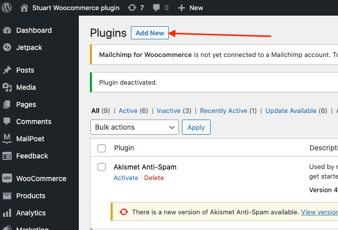

# Stuart WooCommerce Official Plugin (WIP)


Full documentation with user guides for this plugin can be found [here](https://plugins.stuart-apps.solutions/wordpress/getting-started/)

### Installation

#### Option A: Download this plugin from [the official wordpress site](https://placeholder.org/).

#### Option B: Manual installation

1. Download this repository
   ```bash
   git clone https://github.com/StuartApp/stuart-woocommerce-plugin.git
   ```
2. Zip the main folder
   ```bash
   cd stuart-woocommerce-plugin
   zip stuart-woocommerce
   ```
3. Go to your `WordPress Admin Dashboard` >> `Plugins` >> `Add new` and click on `Upload`
   

### Changelog

Visit [Changelog](CHANGELOG.md)

### Branching policies

- Latest stable version is on `master`
- Code to be released on the next version is on `develop`
- Features and bug-fixes are developed on new branches

### FAQ
